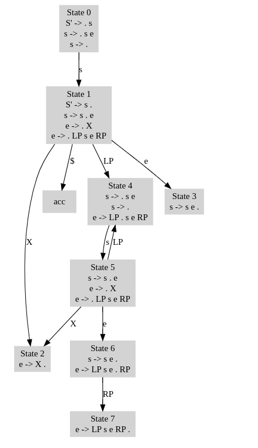

## Example

Augmented grammar

```
0: S' -> s
1: s -> s e
2: s -> ε
3: e -> X
4: e -> LP s e RP
```

First sets

```
FIRST(s) = { ε, X, LP }
FIRST(e) = { X, LP }
```

Follow sets

```
FOLLOW(s) = { $, X, LP }
FOLLOW(e) = { $, X, LP, RP }
```

<div class="page-break"></div>




<div class="page-break"></div>


|State|X|RP|LP|$|s|e|
|--- |--- |--- |--- |--- |--- |--- |
|0|r2||r2|r2|1||
|1|s2||s4|acc||3|
|2|r3|r3|r3|r3|||
|3|r1||r1|r1|||
|4|r2||r2|r2|5||
|5|s2||s4|||6|
|6|r1|s7|r1|r1|||
|7|r4|r4|r4|r4|||


String: `x(x)`


||Stack|Symbols|Input|Action|
|--- |--- |--- |--- |--- |
|0|0||X LP X RP $|reduce by rule 2.|
|1|0 1|s|X LP X RP $|shift|
|2|0 1 2|s X|LP X RP $|reduce by rule 3.|
|3|0 1 3|s e|LP X RP $|reduce by rule 1.|
|4|0 1|s|LP X RP $|shift|
|5|0 1 4|s LP|X RP $|reduce by rule 2.|
|6|0 1 4 5|s LP s|X RP $|shift|
|7|0 1 4 5 2|s LP s X|RP $|reduce by rule 3.|
|8|0 1 4 5 6|s LP s e|RP $|shift|
|9|0 1 4 5 6 7|s LP s e RP|$|reduce by rule 4.|
|10|0 1 3|s e|$|reduce by rule 1.|
|11|0 1|s|$|accept|


<div class="page-break"></div>


String: `(xx)`


||Stack|Symbols|Input|Action|
|--- |--- |--- |--- |--- |
|0|0||LP X X RP $|reduce by rule 2.|
|1|0 1|s|LP X X RP $|shift|
|2|0 1 4|s LP|X X RP $|reduce by rule 2.|
|3|0 1 4 5|s LP s|X X RP $|shift|
|4|0 1 4 5 2|s LP s X|X RP $|reduce by rule 3.|
|5|0 1 4 5 6|s LP s e|X RP $|reduce by rule 1.|
|6|0 1 4 5|s LP s|X RP $|shift|
|7|0 1 4 5 2|s LP s X|RP $|reduce by rule 3.|
|8|0 1 4 5 6|s LP s e|RP $|shift|
|9|0 1 4 5 6 7|s LP s e RP|$|reduce by rule 4.|
|10|0 1 3|s e|$|reduce by rule 1.|
|11|0 1|s|$|accept|


