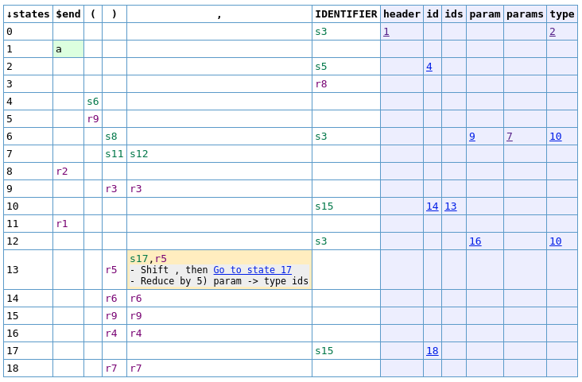
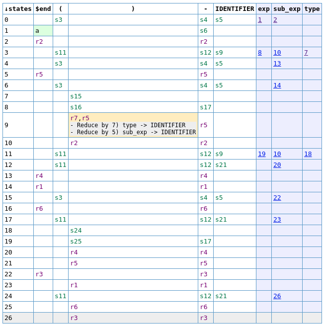

# Parser conflicts + JSON parser

---

# Lab assignment

In this lab we will observe RR and SR conflicts + write a JSON parser

---

# JSON

Notice the recursive structure!

```json
{
  "glossary": {
    "title": "example glossary",
    "GlossDiv": {
      "title": "S",
      "GlossList": {
        "GlossEntry": {
          "ID": "SGML",
          "SortAs": "SGML",
          "GlossTerm": "Standard Generalized Markup Language",
          "Acronym": "SGML",
          "Abbrev": "ISO 8879:1986",
          "GlossDef": {
            "para": "A meta-markup language, used to create markup languages such as DocBook.",
            "GlossSeeAlso": [
              "GML",
              "XML"
            ]
          },
          "GlossSee": "markup"
        }
      }
    }
  }
}
```

---

# LR(1) parser

"1" is referring to 1 lookahead symbol. It is a data being passed along while trainsitioning the parser states.

- Basically we can reduce if the lookahead symbol is the symbol we intended it to be.
- lookahead symbol $b$ in production $A \to \cdot B c, b$ should be $\in \text{FOLLOW}(A)$

---

## SR non-terminals

```text
header
nullable: No
firsts: IDENTIFIER
follows: $end
Productions: 1 2

params
nullable: No
firsts: IDENTIFIER
follows: ),,
Productions: 3 4

param
nullable: No
firsts: IDENTIFIER
follows: ),,
Productions: 5

ids
nullable: No
firsts: IDENTIFIER
follows: ,,)
Productions: 6 7

type
nullable: No
firsts: IDENTIFIER
follows: IDENTIFIER
Productions: 8

id
nullable: No
firsts: IDENTIFIER
follows: (,),,
Productions: 9

$accept
nullable: No
firsts: IDENTIFIER
follows:
Productions: 0
```

---


## SR LR(1) productions

```text
0)   $accept -> header $end
1)   header -> type id ( params )
2)   header -> type id ( )
3)   params -> param
4)   params -> params , param
5)   param -> type ids
6)   ids -> id
7)   ids -> ids , id
8)   type -> IDENTIFIER
9)   id -> IDENTIFIER
```

---

## SR LR(1) parse table



<!--
SR Solution

The SR conflict is arisen after ','. Parser with one lookahead does not know whether it
should reduce to eliminate params non-terminal
    reduce via:
        param -> type ids
    when ids have definition:
        ids -> id
    and this params definition was used:
        params -> params ',' param

OR we are still working on ids
    shift via definition:
        ids -> ids ',' id

The solution is to remove production:
    param : type ids
-->

---

# RR LR(1) productions

```text
0)   $accept -> exp $end
1)   exp -> exp - sub_exp
2)   exp -> sub_exp
3)   sub_exp -> ( type ) sub_exp
4)   sub_exp -> - sub_exp
5)   sub_exp -> IDENTIFIER
6)   sub_exp -> ( exp )
7)   type -> IDENTIFIER
```

---

# RR LR1(1) non-terminals

```text
exp
nullable: No
firsts: (,-,IDENTIFIER
follows: $end,-,)
Productions: 1 2

sub_exp
nullable: No
firsts: (,-,IDENTIFIER
follows: -,$end,)
Productions: 3 4 5 6

type
nullable: No
firsts: IDENTIFIER
follows: )
Productions: 7

$accept
nullable: No
firsts: (,-,IDENTIFIER
follows:
Productions: 0
```

---

# RR LR(1) parse table



<!--
We don't know after seeing:
    ( IDENTIFIER )

Whether we should reduce it to:
    type -> IDENTIFIER
    >> expr -> sub_type -> ( type ) sub_exp -> ( IDENTIFIER ) sub_type

    sub_exp -> IDENTIFIER
    >> expr -> sub_expr -> ( expr ) -> ( sub_expr ) -> ( IDENTIFIER )

The solution is to remove production:
    type : IDENTIFIER
-->

